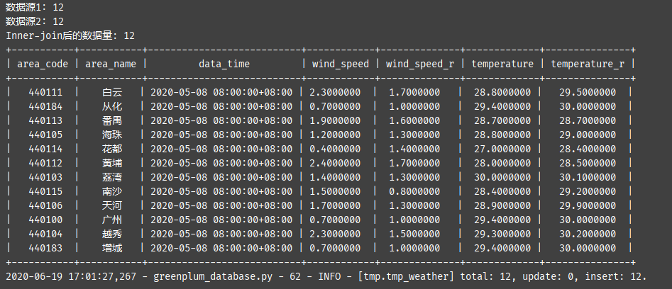

# DataPump
DataPump is a data synchronization tool. 

## Requirements
- Python3.7+

## Features
- support many connectors, such as file, database, ftp, rest api. However only database connector was implemented now.
- support join a dataframe with another dataframe by specified join condition.
- support action as `map`, `filter`, `with_column`, `select`, `sort` etc.
- support many sinks, for example console, file, database, ftp. Unfortunatly database and console sinks are avaliable so far.
- support multi-thread.
- support many write-mode, such as upsert, overwrite, append and so on.

## Code Example
```python
from datetime import datetime
from data_sync import DataPump, WriteMode

source_db = {"db_name": "test1", "host": "192.168.1.1", "user": "test1", "password": "test1", "port": 5432}
target_db = {"db_name": "test2", "host": "192.168.1.2", "user": "test2", "password": "test2", "port": 5432}

dp = DataPump()

dp.read(parallel=True) \
    .from_rdb(db_type="greenplum") \
    .connect(**source_db) \
    .from_sql("select data_time,area_name,area_code,wind_speed,temperature "
              "from test.weather_hour where data_time='2020-05-08 08:00:00' and area_code like '4401%'") \
    .get()

dp.read(parallel=True) \
    .from_rdb(db_type="greenplum") \
    .connect(**source_db) \
    .from_sql("select data_time,area_name,area_code,wind_speed,temperature "
              "from test.weather_hour where data_time='2020-05-09 08:00:00' and area_code like '4401%'") \
    .get()

data1, data2 = dp.wait_reader()

data1_2 = data1.with_column("hour", lambda x: x.data_time.hour)
print("数据源1:", data1_2.row_number)
data2_2 = data2.with_column("hour", lambda x: x.data_time.hour)
print("数据源2:", data2_2.row_number)

data3 = data1_2.join(
    others=data2_2,
    join_type="inner",
    condition_groups=data1_2.column.hour.eq(data2_2.column.hour)
        .and_(data1_2.column.area_code.eq(data2_2.column.area_code)
              #.or_(data1_2.column.area_name.eq(data2_2.column.area_name))
              )
)

print("Inner-join后的数据量:", data3.row_number)
data3_2 = data3.sort(area_name="asc", data_time="desc")

data3_3 = data3_2.select("area_code","area_name","data_time","wind_speed","wind_speed_r","temperature","temperature_r")

dp.write().with_data(data3_3).to_console()
dp.write() \
    .with_data(data3_3) \
    .to_rdb(db_type="greenplum") \
    .connect(**target_db) \
    .to_table("tmp.tmp_weather") \
    .write_mode(WriteMode.upsert) \
    .upsert_by("data_time", "area_code") \
    .conflict_action(
        update_others_columns=True,
        update_time=datetime.now().isoformat()
    ) \
    .start()
```
输出:




